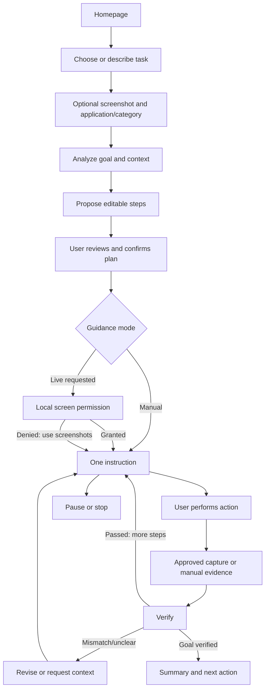

# 02 · Functional specification

Status: proposed MVP. Functional IDs align with R01–R30 through [17](17-traceability-matrix.md). All routes are defined in [07](07-api-contracts.md); all states in [05](05-session-state-machine.md).

## Complete flow

## Behaviors and acceptance

| ID | Behavior | Acceptance and boundaries |
|---|---|---|
| F01 | Homepage | Primary Start a task, Upload a screenshot, Continue a previous task. Logged-out users may draft locally but authenticate before any upload or backend task creation. Draft media stays in page memory |
| F02 | Task creation | Goal 1–4,000 characters, optional title ≤120, category from MVP enum, application key or `unknown`; ask a focused clarification if success criterion is absent. Creating a task creates its first session in `task_created` |
| F03 | Screenshot lifecycle | Explicit chooser/paste/drop enters local preview; crop/blur before Upload; upload associates owner/task and optional session. Replacement creates new immutable screenshot and invalidates jobs referencing the old one. Delete cancels derived work and removes usable evidence |
| F04 | Text and voice | Text ≤4,000 characters; push-to-talk ≤30 seconds; editable transcript, then Send. Listening indicator and Cancel mandatory. Explicitly enabled voice stop/pause may act locally immediately; voice never grants permissions or approves risky actions |
| F05 | Planning and confirmation | Show 1–12 proposed steps, editable title/instruction and success criterion, app changes, risk and context needs. Edits produce a new plan version and reset confirmation. Confirm displayed version explicitly; no start on stale or unconfirmed plan |
| F06 | Startup and permissions | Select screenshot-only or live. Live uses a registered native device, local consent preview and OS picker; backend records request/result but cannot grant OS access. Denial offers screenshot-only. Successful start consumes the current confirmed plan |
| F07 | Dot and pointer | Floating edge dot opens control panel; pointer shows only an evidence-backed location. Screenshot-only markers stay inside the image viewer. Native markers expire on changed window geometry, context or evidence age |
| F08 | Instruction display | Exactly one actionable current step. Include what, where, optional why, Done/check method and “I can't find it.” Full plan and explanation are secondary views; previous steps marked as history |
| F09 | Completion and verification | Done records `user_claimed`; separately request verification with fresh screenshot or explicit bounded self-report. `passed` requires objective evidence. Self-report can yield `user_reported` final outcome, never `achieved` |
| F10 | Recheck and revision | “Check again,” a new screenshot or “incorrect” invalidates current pointer. Verify fresh context; mismatches get at most two revised attempts before `blocked` and a manual alternative. Material plan edits require confirmation again |
| F11 | Pause | Pause observation is session pause: local capture gate closes before network request; remove pointer, cancel pending media/model jobs, preserve readable instruction/history. Manual uploads and questions work in `paused` without automatic progression |
| F12 | Stop/terminate | Emergency stop, panel Stop, closing active client or signing out immediately remove all overlay windows and capture. Backend enters `stopping` then `completed` with `stopped` outcome. Cleanup never waits on an LLM. A summary remains available in web/history |
| F13 | Resume/restart/expiry | Resume paused/blocked session at its checkpoint after fresh context review. Observation grants are never restored. Restart task makes a new session and links previous ID; completed/failed/expired sessions cannot be reopened. Expiry: 30 min without user activity except explicit pause; 24 h absolute session lifetime |
| F14 | Summary/history/feedback | Private newest-first cursor history; show task/app/time/outcome, verified versus unverified steps, corrections and next action. Feedback can flag a specific instruction/evidence without raw content in logs. Continue identifies whether it resumes or creates a successor |
| F15 | Identity and devices | Supabase login, owner checks and registered native device binding for capture; reject cross-user IDs and revoked devices |
| F16 | Privacy | Preview before manual upload; observe permission scope and active indicator; per-image/session deletion with visible pending/purged state; no video recording |
| F17 | Risk and app gates | Safety checks at intake, planning, instruction and verification. Unsupported or sensitive application blocks capture; confirmed app switching requires a new grant |
| F18 | Untrusted context | Text in websites/images cannot become tool instructions or consent. Model output validated before it is shown or persisted as an instruction |
| F19 | Boundaries | Both clients call only User Mode API for Guide data; backend coordinates providers and internal agents; no browser-to-LLM calls |
| F20 | State consistency | Versioned commands, atomic state/event writes, idempotent retries and stale-response rejection across clients |
| F21 | Accessibility | Complete flow keyboard-operable; screen-reader state labels; focus returned after panel close; 200% text zoom and mixed DPI supported |
| F22 | Degraded mode | Stop capture on network/auth failure; retain last safe explanation; manually draft new context offline without uploading or claiming verification |
| F23 | Budgets | Show retry time on rate limits; one active media operation per session and bounded retries; content-free metrics |
| F24 | Certified tasks | Provide six initial category tiles and app-specific fixtures; unsupported versions request context instead of invented controls |
| F25 | Domain expansion | Use taxonomy feature flags; list future domains as unavailable until their acceptance packs pass |
| F26 | Learning transition | Future opt-in suggestion after explicit pattern analysis permission; preview shared summary, authorize through Agent Zero, remain in Guide if unavailable |
| F27 | Lifecycle | User-launched signed native client; updates only while idle; crash restart opens recovery view with observation off |
| F28 | Testability | Expose development test adapters for capture/provider faults; never ship bypasses for consent or owner checks |
| F29 | Action confirmation | Medium-risk concrete changes and permitted high-risk final actions need a specific on-screen confirmation bound to instruction version/target; rejection skips or revises the step |
| F30 | Documentation alignment | Before code changes, reconcile implemented routes/models with specification; update inspection evidence and ADRs for contract changes |

## Edge-flow rules

Before session start a screenshot can support explanation only: analyze, view highlighted answer, then optionally generate a plan. Planning is not required to read an explanation. Screen observation is never necessary for this flow.

While paused, a submitted screenshot starts a media operation without changing the session out of `paused`. The response is an explanation or verification suggestion, not a newly active instruction. Resume requires confirming the checkpoint; any changed plan must be reconfirmed. A question does not advance a step, reset a risk challenge or grant observation.

Application switches explicitly name the next app and prompt for a new local selection. Browser app allowlisting does not allow every website. Authentication screens, payment pages and other blocked surfaces terminate the current observation grant. Password entry occurs outside observation; do not ask users to paste secrets.

“Done,” a click detected visually, a successful provider request and a submitted form button disappearing are not independently proof that the goal succeeded. Use the step's expected evidence and report uncertainty. Final summary has deterministic fallback construction if the LLM is unavailable.

Example: User says “I clicked it but the error is still there.” Guide removes its old marker, says “Please upload the current error area,” compares new evidence, records `mismatch`, and suggests one revised action. It must not tell the user that the problem was fixed.

## Assumptions, dependencies and open decisions

Assumes a single controlling client per live session and English MVP copy. Transfer between devices pauses the old controller and requires fresh registration/consent. Depends on 03–09 and 11–14; D01/D03/D07 affect provider, Windows and usability pilots. Security: SEC-01–SEC-16 in 09. Master traceability: [17](17-traceability-matrix.md).
