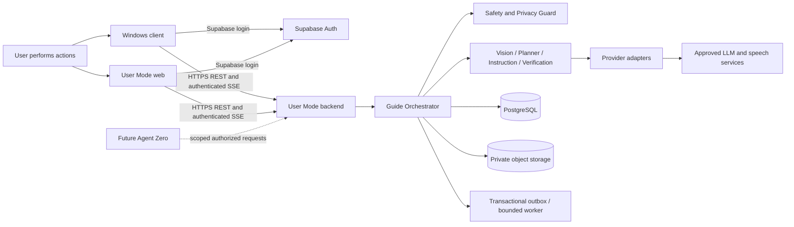

# 06 · System architecture

Local development exception: [ADR-015](adr/015-browser-observation-and-personal-cloud.md) adds `LiveGuide.tsx` and a loopback-only `/api/v1/local-guide` router in `app/cloud.py`. An ephemeral capability authorizes personal OpenAI frame checks, with no access to account data or persisted media. `/api/v1/guide` retains Supabase authentication. See [19](19-implementation-status.md) for implemented scope.

Status: proposed architecture; no existing service or dependency was discovered. ADR-001/008/013/014 explain boundaries and stack. The names below are implementation destinations, not existing directories.

## Deployment boundaries

| Boundary | Proposed implementation / deployment | Owns | Must not do |
|---|---|---|---|
| `user-mode/web` | React + TypeScript + Vite static web app, independent build | Homepage, task/plan/history, manual media preview, Supabase login, API client | Direct Guide DB/storage/LLM calls, browser desktop capture in MVP |
| `user-mode/client/windows` | WPF C#/.NET with Win32/capture adapters, signed MSIX | Native consent, capture gate, overlay, local microphone, secure credentials | Shell/input execution, unrestricted file access, background capture |
| `user-mode/backend` | Python FastAPI/Pydantic, SQLAlchemy, Alembic, separate API and worker entrypoints | JWT/ownership, contracts, Orchestrator, persistence, rate limits, provider mediation | Delegate auth policy to model or accept client-declared success |
| Guide domain | Modules inside backend, not separately deployed autonomous agents in MVP | State and role coordination, durable operations, policy | Arbitrary cross-service calls or direct agent-to-agent messages |
| Persistence | PostgreSQL authoritative; private object storage for ≤24 h media | Durable owner-scoped state and media TTL | Store video; expose buckets publicly |
| Identity | Supabase Auth | User authentication, refresh/session issuance, signing keys | Substitute Clerk or invent a parallel identity database |

SQLAlchemy supports repository abstractions; SQLite may be used for isolated unit tests only, not production concurrency/retention semantics. Use PostgreSQL in integration/contract tests and local full stack. No migrations currently exist. Supabase-managed PostgreSQL/object storage are eligible for D02, but clients still use backend Guide APIs. Core functionality cannot depend on Learner Mode availability.

## Internal responsibilities and control flow

Orchestrator validates input → checks policy → captures a transactionally versioned operation → dispatches one bounded role → validates result → rechecks policy/epoch → commits event and state. Context/Vision parses sanitized images; Planner proposes a finite plan; Instruction generator emits one structured instruction; Verification checks declared evidence predicates; Explanation/Debugger answers “why” without changing step outcome. Safety Guard runs deterministic gates before/after all roles. Roles share immutable envelopes and return results to Orchestrator, never call each other directly.

Provider adapter interfaces: `analyze_images(context)`, `plan_task(context)`, `generate_instruction(context)`, `verify_step(context)`, `explain(context)`, `transcribe(audio)`. Each accepts cancellation/deadline, request ID, allowed output schema and budget; returns normalized result/usage/error. No provider tool execution. Vision may be the same model provider as language, but contracts remain separate. Model selection and data handling are D01; do not hardcode Claude or claim it already exists.

Voice MVP: client records explicit ≤30-second clip, backend validates/transcribes, user edits result, then submits as an ordinary UserCommand. Microphone permission and screen permission are independent. No wake word, passive listening or streaming transcription required. Local recognized emergency pause/stop may fire only while user intentionally enabled voice input; physical controls work without transcription service.

API and worker use a PostgreSQL Operation queue with transactional outbox. Atomic claim/lease, one active operation per session, 90-second worker lease renewed during work, 65-second total Operation deadline (at most two 30-second provider attempts plus bounded backoff); cancellation checked before provider call and commit. A worker crash causes reconciliation, not blind duplicate provider calls. Provider-request ambiguity is surfaced as recoverable failure unless adapter guarantees idempotency. Redis/broker is unnecessary in MVP; adding it requires operational justification and preserved durability.

## Proposed frontend routes and service configuration

| Web route | Purpose |
|---|---|
| `/` | Three-action home and local goal draft |
| `/sign-in`, `/auth/callback` | Supabase authentication and code exchange |
| `/tasks/new` | Task/context creation |
| `/tasks/:taskId` | Context, screenshot explanation, plan editor and review |
| `/sessions/:sessionId` | Instruction, manual evidence, pause/resume, summary |
| `/history` | Private task/session continuation |
| `/privacy` | Retention, devices, data deletion and provider disclosure |

Suggested local ports: web 5173, backend 8000, PostgreSQL 5432. These are new defaults, not preserved contracts; native client does not expose a local HTTP control server. Production routes use HTTPS behind an ingress; `/health/live` returns liveness only, `/health/ready` checks required dependencies with no secrets. All Guide routes use `/api/v1/guide` per 07.

| Proposed environment/config key | Consumer | Classification / behavior |
|---|---|---|
| `VITE_GUIDE_API_BASE_URL` | Web | Public backend URL, exact origin |
| `VITE_SUPABASE_URL`, `VITE_SUPABASE_PUBLISHABLE_KEY` | Web | Public identity configuration, never service-role key |
| `GUIDE_API_BASE_URL`, `SUPABASE_URL`, `SUPABASE_PUBLISHABLE_KEY` | Native packaged config | Public environment-specific values, trusted update/config source |
| `SUPABASE_URL`, `SUPABASE_JWT_ISSUER`, `SUPABASE_JWT_AUDIENCE` | Backend | Expected project/issuer/audience; reject cross-project tokens |
| `SUPABASE_JWKS_URL` | Backend | Derived trusted HTTPS identity endpoint; not client-selectable |
| `SUPABASE_SERVER_SECRET_KEY` | Backend deletion/admin worker only | Optional privileged credential for account deletion; secret store only; never ordinary request auth |
| `DATABASE_URL` | Backend/worker | Secret connection string; TLS and restricted DB role |
| `OBJECT_STORAGE_ENDPOINT`, `OBJECT_STORAGE_BUCKET` | Backend/worker | Private media storage configuration |
| `OBJECT_STORAGE_CREDENTIAL`, `KMS_KEY_ID` | Backend/worker | Managed identity preferred; never returned to clients |
| `LLM_PROVIDER`, `LLM_MODEL`, `LLM_API_KEY`, `LLM_REGION` | Provider worker | Approved adapter, pinned model/region; key secret |
| `STT_PROVIDER`, `STT_MODEL`, `STT_API_KEY`, `STT_REGION` | Speech worker | Independent approved provider config |
| `GUIDE_ALLOWED_ORIGINS`, `GUIDE_APP_ALLOWLIST_VERSION` | Backend/native | Exact CORS origins; signed/versioned app policy |
| `GUIDE_LOG_LEVEL`, `OTEL_EXPORTER_OTLP_ENDPOINT` | Backend | Metadata-only observability; no payload export |
| `GUIDE_ENVIRONMENT` | All | dev/staging/prod, fail startup on mixed identity/API environments |

No `.env` files or example secrets are created in this documentation-only phase. Retention/limits are constants from 03/07/08 with centrally validated configuration: deployment may tighten limits, never silently relax documented maxima.

## Authentication, operations and observability

Supabase issues user JWTs. Backend verifies signatures/issuer/audience/expiry and active app identity/device authorization per 09; user ID always comes from verified `sub`. Native capture endpoints additionally bind device and controller; event connections authenticate using headers. All object reads go through backend ownership checks. Use migration-managed tables, owner indexes, least-privilege service roles and RLS if exposing any Supabase database integration; Guide tables are not directly exposed to clients.

Capture metrics: gate-close latency, accepted still count, denied/stale epoch frames, consent duration, media purge lag. Session metrics: operation/first-instruction latency, mismatch rate, task outcome, retries, provider usage. Security metrics: auth failures, denied ownership, risky confirmations, policy blocks, revocations. Exclude screenshots, transcripts, prompts, JWTs, window titles and full URLs from logs/traces. Trace request → operation → sanitized provider request ID → event using random IDs. Sampling never overrides the security audit requirements.

Rate limits combine per-user, per-device and IP ceilings plus per-session concurrency; gateway and application enforce the same policies. Native fail-closed safety is independent of backend uptime. Daily lifecycle worker and frequent media sweeper enforce deletion; alert on overdue jobs. Backup restore reapplies deletion ledger before serving traffic.

## Future Kurukul integration

Expose a future internal, versioned capability entrypoint with Agent Zero-issued short-lived purpose/owner/mode/task scopes. Agent Zero authorizes cross-mode requests; Guide still owns its sessions and capture grants. User Mode may offer a learning handoff carrying skill tags and a user-approved summary, never raw media/tokens or an observation grant. Learner Mode failure does not pause Guide. Atlas can supply explanations through the Orchestrator; Builder practical guidance; Detector only explicit purpose-limited progress signals; Scout proposes learning paths. No peer agent network or shared unrestricted database.

## Assumptions, dependencies, decisions and traceability

Assumes HTTPS reachability and authenticated individual use. D01/D02/D04 remain deployment gates. ADR-014 governs stack changes; neither selected SDK version nor cloud has been verified as installed. R15/R19/R23/R26/R27/R30 → F15/F19/F23/F26/F27/F30 → T15/T19/T23/T26/T27/T30; [17](17-traceability-matrix.md). Security SEC-01/02/09/10/11/14/16 applies to every boundary.
