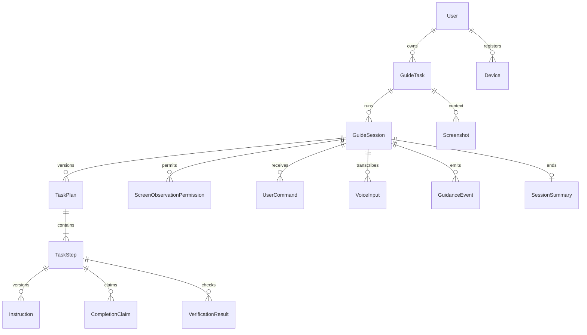

# 08 · Data model

Status: proposed schema, no existing database/models/migrations. PostgreSQL is authoritative; SQLAlchemy mapping and Alembic migrations are implementation tasks. This file owns entity names, enums and retention. API projections in [07](07-api-contracts.md) deliberately omit internal fields.

## Conventions and relationships

All persisted entities except User inherit `id UUID PK`, `owner_id UUID NOT NULL FK User.id`, `created_at TIMESTAMPTZ NOT NULL`, `updated_at TIMESTAMPTZ NOT NULL`, with two erasure exceptions: SafetyEvent and DeletionJob have nullable owner_id and nullable direct resource linkage after account purge, as described below. User uses its Supabase `sub` as primary ID. `?` = nullable/optional; other fields required. JSON fields must validate against versioned application schemas, not arbitrary model output. All records have a documented status below; append-only events instead have immutable `result`/`type`. Timestamps use database UTC; optimistic versions are positive BIGINT. Bytes are BIGINT; lengths/counts INT; text bounded at API and database. No `owner_id` is accepted from clients.

Common indexes: `(owner_id,created_at DESC,id)` for owned lists; explicit FK indexes; retention worker indexes on `expires_at`/`deleted_at` when present. Ownership queries include owner even when UUID known. Child owner must equal parent owner; enforce composite foreign keys `(owner_id,parent_id)` with corresponding unique parent keys. Audit-referenced IDs are not unrestricted cascading FKs. Session/task data never shares another user's evidence.

Screenshots optionally belong to a session as well as their task. Task-level pre-session images remain task-owned. An EvidenceLink join associates screenshot to AnalysisResult/Instruction/VerificationResult/Feedback with owner, consumer type/ID, screenshot ID/version and `availability:available|deleted|expired`; unique `(consumer_type,consumer_id,screenshot_id,version)` and indexes on screenshot/consumer. No polymorphic reference may evade explicit service-layer/FK-equivalent consistency checks; separate join tables are preferred in migrations for strong FKs.

## Authoritative enums

| Enum | Values / semantics |
|---|---|
| Category | `setup`, `run`, `debug`, `understand`, `test`, `git_github`; expansion adds values through API review |
| TaskStatus | `open`, `completed`, `archived`, `deleting`; task completed only for achieved/user_reported session outcome, stays open after stop/failure/expiry |
| SessionState | `task_created`, `analyzing`, `plan_ready`, `awaiting_user_confirmation`, `awaiting_screen_permission`, `active`, `capturing`, `processing`, `instruction_ready`, `awaiting_user_action`, `verifying`, `blocked`, `paused`, `stopping`, `completed`, `failed`, `expired`; `idle` is local only |
| Outcome | `achieved`, `user_reported`, `stopped`, `failed`, `expired`; null until terminal |
| StepStatus | `pending`, `instruction_ready`, `awaiting_user_action`, `user_claimed`, `verified`, `blocked`, `skipped`, `superseded` |
| MediaStatus | `accepted`, `processing`, `ready`, `rejected`, `deleting`, `deleted`, `expired` |
| VerificationStatus | `pending`, `passed`, `mismatch`, `inconclusive`, `user_reported`, `canceled` |
| PermissionStatus | `requested`, `granted`, `denied`, `revoked`, `expired` |
| OperationStatus | `queued`, `running`, `succeeded`, `failed`, `canceled` |
| Risk | `low`, `medium`, `high`; `blocked` is policy disposition, not a fourth risk level |
| ObservationMode | `screenshot_only`, `window`; a mode never constitutes consent |

MVP objectively verifies visual screenshot evidence only. Typed/pasted output is useful context but remains user-supplied self-report. `text` evidence/verifier enum values reserve a later authenticated source adapter; reject them in MVP plan creation/result commits. This avoids inventing a file/terminal execution integration.

## Entity fields, constraints and ownership

Base fields above apply to every row; all entities are owner-private. Lifecycle codes in the following section specify retention, deletion and audit requirements for **each row**.

| Entity | Additional fields (type, optionality) | Relationships / indexes / constraints | Lifecycle |
|---|---|---|---|
| User | `id UUID=Supabase sub`, `status TEXT active\|deleting\|deleted`, `locale TEXT`, `privacy_notice_version TEXT`, `analytics_opt_in BOOL=false`, `auth_revoked_before TIMESTAMPTZ?`, `created_at`, `updated_at`, `deletion_requested_at TIMESTAMPTZ?` | No password/hash or duplicate auth provider; unique id; index status/deletion_requested_at | U |
| Device | `name VARCHAR(80)`, `platform TEXT=windows`, `client_version VARCHAR(40)`, `credential_hash BYTEA`, `installation_nonce UUID`, `status TEXT active\|revoked`, `last_seen_at TIMESTAMPTZ`, `revoked_at TIMESTAMPTZ?` | FK User; unique(owner,installation_nonce); index owner/status; max 5 active; secret hash only, compare constant-time | D |
| GuideTask | `title VARCHAR(120)`, `goal VARCHAR(4000)`, `category Category`, `application_key VARCHAR(80)`, `status TaskStatus`, `current_session_id UUID?`, `expires_at TIMESTAMPTZ`, `deleted_at TIMESTAMPTZ?` | Owner/current session consistency; unique(owner,id); index status/updated_at; current_session belongs to task | H |
| GuideSession | `task_id UUID`, `previous_session_id UUID?`, `state SessionState`, `state_version BIGINT=1`, `control_epoch BIGINT=1`, `checkpoint_state SessionState?`, `current_step_id UUID?`, `confirmed_plan_version INT?`, `controller_device_id UUID?`, `observation_mode ObservationMode=screenshot_only`, `outcome Outcome?`, `block_reason TEXT?`, `last_user_activity_at TIMESTAMPTZ`, `expires_at TIMESTAMPTZ`, `ended_at TIMESTAMPTZ?`, `deleted_at TIMESTAMPTZ?` | Partial unique task where nonterminal; index owner/state/activity; terminal requires outcome and ended_at; absolute expires_at=created+24h; idle forbidden | H |
| TaskPlan | `task_id UUID`, `session_id UUID`, `version INT`, `status TEXT draft\|confirmed\|superseded`, `assumptions JSONB array<string>`, `confirmed_at TIMESTAMPTZ?`, `confirmed_by UUID?`, `policy_version TEXT` | Unique(session,version); only current version confirmed; confirms bind owner; new version supersedes old | H |
| TaskStep | `plan_id UUID`, `session_id UUID`, `ordinal INT`, `title VARCHAR(120)`, `action VARCHAR(1000)`, `application_key VARCHAR(80)`, `risk Risk`, `policy_disposition TEXT allow\|confirm\|block`, `success_criterion VARCHAR(500)`, `evidence_kind TEXT visual\|text\|self_report`, `required BOOL`, `status StepStatus`, `attempt_count INT=0`, `verified_at TIMESTAMPTZ?` | Unique(plan,ordinal), ordinal 1..12; versioned plans own immutable step definitions, runtime status mutable; new plan may reference predecessor via optional `previous_step_id UUID?` | H |
| Screenshot | `task_id UUID`, `session_id UUID?`, `source TEXT manual\|observation`, `purpose TEXT context\|verification\|error\|disagreement`, `version INT=1`, `status MediaStatus`, `content_type TEXT`, `byte_size BIGINT`, `width INT`, `height INT`, `object_key TEXT?`, `derivative_keys JSONB array<string>`, `content_hash BYTEA`, `captured_at TIMESTAMPTZ`, `expires_at TIMESTAMPTZ`, `replaces_screenshot_id UUID?`, `permission_id UUID?`, `control_epoch BIGINT?`, `capture_generation BIGINT?`, `redaction_version TEXT`, `deleted_at TIMESTAMPTZ?` | Observation requires permission/epoch/generation/session; object key random/private; index expires_at/status/task; immutable accepted pixels; deleted has no object keys/hash | M |
| ScreenObservationPermission | `session_id UUID`, `device_id UUID`, `status PermissionStatus`, `app_key VARCHAR(80)`, `scope TEXT=window`, `crop JSONB BBox?`, `scope_fingerprint TEXT`, `consent_version TEXT`, `nonce_hash BYTEA?`, `nonce_expires_at TIMESTAMPTZ`, `control_epoch BIGINT`, `granted_at TIMESTAMPTZ?`, `expires_at TIMESTAMPTZ?`, `lease_expires_at TIMESTAMPTZ?`, `revoked_at TIMESTAMPTZ?`, `reason TEXT?` | One granted permission/session; nonce single-use; index session/status/expiry; no window title/path/handle; persisted granted row cannot restore local OS access | C |
| CaptureIntent | `session_id UUID`, `permission_id UUID`, `intent TEXT context\|verify`, `step_id UUID?`, `claim_id UUID?`, `control_epoch BIGINT`, `status TEXT requested\|received\|canceled\|expired`, `expires_at TIMESTAMPTZ`, `received_screenshot_id UUID?` | Verify requires step/claim; one unconsumed intent/session; deadline created+5s; unique received screenshot; screenshot upload links `capture_intent_id UUID?` and must consume it atomically | O |
| UserCommand | `session_id UUID`, `source TEXT text\|voice`, `text VARCHAR(4000)`, `intent TEXT ask\|next\|repeat\|stuck\|incorrect\|pause\|resume\|stop`, `status TEXT accepted\|processed\|rejected`, `voice_input_id UUID?`, `control_epoch BIGINT` | Source voice requires matching accepted transcript; index session/created_at; transcript copy redacted; no secret retention | H |
| VoiceInput | `session_id UUID`, `status TEXT accepted\|transcribing\|ready\|failed\|deleted\|expired`, `content_type TEXT`, `byte_size BIGINT`, `duration_ms INT`, `language TEXT`, `transcript VARCHAR(4000)?`, `confidence REAL?`, `consent_version TEXT`, `audio_expires_at TIMESTAMPTZ`, `transcript_expires_at TIMESTAMPTZ`, `provider_request_id TEXT?` | Audio memory/temporary encrypted staging only; no durable audio object key; ≤30,000ms, ≤5MiB; index expiry/status | V |
| AnalysisResult | `task_id UUID`, `session_id UUID`, `status TEXT ready\|invalidated`, `observations JSONB`, `explanation TEXT<=4000`, `needs_context BOOL`, `context_request VARCHAR(500)?`, `expires_at TIMESTAMPTZ` | Evidence links required; observations boxes/labels schema from 07; index session/expiry; expires with earliest evidence | M |
| Instruction | `session_id UUID`, `step_id UUID`, `version INT`, `status TEXT ready\|superseded\|invalidated`, `what VARCHAR(1000)`, `where VARCHAR(300)`, `why VARCHAR(500)?`, `confirmation_hint VARCHAR(300)`, `cannot_find_hint VARCHAR(300)`, `pointer JSONB?`, `action_confirmation_id UUID?`, `control_epoch BIGINT`, `evidence_available BOOL=true` | Unique(step,version); evidence links; pointer timestamp ephemeral; only one current instruction/session | H with M-derived scrub |
| CompletionClaim | `session_id UUID`, `step_id UUID`, `statement VARCHAR(1000)`, `status TEXT user_claimed\|superseded`, `instruction_version INT`, `claimed_at TIMESTAMPTZ` | FK current instruction/step; index step/claimed_at; not a verification result | H |
| VerificationResult | `session_id UUID`, `step_id UUID`, `claim_id UUID`, `status VerificationStatus`, `verifier_kind TEXT visual\|text\|self_report`, `reason VARCHAR(1000)`, `evidence_available BOOL`, `instruction_version INT`, `control_epoch BIGINT`, `completed_at TIMESTAMPTZ?` | Evidence links; index step/created_at; passed requires objective evidence and matching versions; no OCR blobs | H with M-derived scrub |
| ActionConfirmation | `session_id UUID`, `step_id UUID`, `instruction_version INT`, `action TEXT`, `target_summary VARCHAR(500)`, `target_hash BYTEA`, `consequence VARCHAR(500)`, `risk Risk`, `status TEXT pending\|confirmed\|declined\|expired\|consumed`, `policy_version TEXT`, `expires_at TIMESTAMPTZ`, `decided_at TIMESTAMPTZ?`, `consumed_at TIMESTAMPTZ?` | Index step/status/expiry; target/version bound, max 5 min; cannot create for blocked action; no secret target contents | C |
| GuidanceEvent | `session_id UUID`, `sequence BIGINT`, `state_version BIGINT`, `control_epoch BIGINT`, `type TEXT`, `payload JSONB metadata-only`, `request_id UUID`, `published_at TIMESTAMPTZ?`, `expires_at TIMESTAMPTZ` | Unique(session,sequence), index unpublished/sequence; append-only; transactional outbox source | E |
| UserFeedback | `session_id UUID`, `instruction_id UUID?`, `kind TEXT incorrect_guidance\|helpful\|unhelpful\|privacy_concern`, `text VARCHAR(2000)?`, `status TEXT received\|reviewed\|resolved` | Evidence links optional; index kind/created_at; human support access separately authorized and audited | H |
| SafetyEvent | `session_id UUID?`, `device_id UUID?`, `action TEXT`, `result TEXT allowed\|denied\|confirmed\|revoked\|deleted`, `reason_code TEXT`, `policy_version TEXT`, `scope_hash BYTEA?`, `request_id UUID`, `expires_at TIMESTAMPTZ` | Append-only; index owner/time/action; minimal content-free evidence of safety decision | A |
| SessionSummary | `session_id UUID`, `outcome Outcome`, `verified_steps JSONB UUID[]`, `unverified_steps JSONB UUID[]`, `corrections JSONB string[]`, `text VARCHAR(4000)`, `next_action VARCHAR(500)?`, `status TEXT ready\|redacted` | Unique(session); no screenshot thumbnails/raw transcripts; outcome agrees with session | H |
| Operation | `session_id UUID?`, `task_id UUID?`, `kind TEXT analyze\|plan\|instruction\|verify\|transcribe\|delete`, `status OperationStatus`, `expected_state_version BIGINT?`, `control_epoch BIGINT?`, `request_digest BYTEA`, `result_ref UUID?`, `error_code TEXT?`, `attempt_count INT`, `deadline_at TIMESTAMPTZ`, `lease_owner TEXT?`, `lease_expires_at TIMESTAMPTZ?`, `completed_at TIMESTAMPTZ?`, `expires_at TIMESTAMPTZ` | Index queued/status/lease expiry; evidence links; no embedded raw provider result/prompt; only schema-validated result refs | O |
| IdempotencyRecord | `method TEXT`, `route TEXT`, `key UUID`, `request_digest BYTEA`, `status_code INT`, `response_ref JSONB`, `status TEXT committed\|tombstoned`, `expires_at TIMESTAMPTZ` | Unique(owner,method,route,key); response references, never raw media/tokens except encrypted short-lived device first-response envelope; replay checks deletion | O |
| DeletionJob | `scope TEXT screenshot\|session\|task\|account`, `resource_id UUID`, `status TEXT queued\|purging\|purged\|failed`, `requested_at TIMESTAMPTZ`, `online_purge_due_at TIMESTAMPTZ`, `backup_expiry_due_at TIMESTAMPTZ?`, `completed_at TIMESTAMPTZ?`, `attempt_count INT`, `last_error_code TEXT?` | Index status/due; unique active(scope,resource); account receipt accessible before final auth removal | X |

ActionConfirmation additionally stores required `plan_version INT` and private `pending_instruction JSONB` validated against Instruction schema; payload is nullable after expiry/decline/consumption. `instruction_version` is reserved for that exact final instruction. Confirmation publishes it and consumes the challenge atomically. Preparatory instructions have a distinct earlier version. Any pending-content/target/plan change expires the challenge rather than silently altering what was confirmed.

Account erasure nulls SafetyEvent.owner_id/session_id/device_id and removes direct linkage from retained audit metadata through an audited privileged privacy operation; append-only applies to normal event writes, not mandated retention/erasure. DeletionJob.resource_id and owner_id become null after account erasure; required `erasure_fingerprint BYTEA?` is then a keyed nonreversible lookup for restore suppression under X, never publicly exposed. The local User row can then be removed after Supabase identity deletion. Operational receipts are readable only before identity erasure. Set nullable lineage/current pointers to null on parent purge (`previous_session_id`, `previous_step_id`, `current_session_id`, `controller_device_id`) so retention does not preserve unrelated old data. Keep child-owner constraints for all live owned records.

## Retention and deletion authority

| Code | Retention | Deletion behavior | Audit |
|---|---|---|---|
| U | Account lifetime; erase on authenticated account deletion | Mark deleting/revoke immediately; purge owned data, then delete Supabase identity through privileged worker; no password data to migrate | S/A events, de-identify after erasure |
| D | Active registration until revoked; purge inactive/revoked records after 30 days unless active task references require tombstone until task expiry | Revoke credential immediately, pause controller; erase credential hash and label on deletion | Registration, revoke, denied use |
| H | Task/session content 30 days since last explicit task activity; closed sessions max 30 days after ended_at, whichever relevant deadline is earlier; activity in a new session does not extend old session retention | Tombstone immediately; erase related plans/steps/commands/instructions/verifications/feedback/summary and operation refs; task expiry cascades all children | Create/change/delete metadata; no body text |
| M | Images/derivatives/extracted image context ≤24 h from ingest; analysis expires with earliest source; no media in backups | Inaccessible synchronously on delete/expiry; erase online objects and derived context within 24 h of request, hourly sweeper catches TTL; no permanent original | Upload/read/reject/purge metadata |
| V | Raw voice until transcription completes or 5 min after upload, whichever first; transcript ≤24 h | Cancel deletes buffers/staging; accepted UserCommand is a separately reviewed/redacted H record; no audio backups | Consent/duration/result only |
| C | Consent/confirmation detail ≤30 days or parent deletion; security event retains only content-free decision | Revocation immediate; erase nonce/scope/target data with parent; no reusable grants | Each decision/revocation/expiry to A |
| E | Event replay 7 days or parent deletion, earlier wins | Delete outbox/replay payloads after retention; snapshot remains canonical until parent expiry | Append-only while retained |
| A | Security audit metadata 90 days; no raw user content | On account deletion remove direct identity/device/task linkage, retain minimal de-identified abuse/operational counters until 90-day expiry; D06 must approve notice and justification | Restricted append-only access, reviewed export |
| O | Operation result lookup and idempotency refs 24 h; earlier source deletion scrubs/tombstones | Cancel on epoch change/deletion; erase refs/results when parent or evidence expires; duplicates cannot revive them | Dispatch/outcome/usage metadata |
| X | Deletion receipt/erasure ledger 30 days after completion; failed jobs retained until resolved | After account deletion preserve only irreversible keyed resource fingerprints needed to suppress backup resurrection; key restricted, not treated as anonymous before expiry | Purge progress and overdue alerts |

All explicit user deletions: block reads/new writes immediately, online purge target ≤24 hours, backups expire within 30 days after deletion. Encrypted database backups may contain H/C data but exclude media/audio/provider payloads. Restore into isolated environment, apply erasure ledger/tombstones before serving. If provider holds already sent data, contractual D01/D06 deletion period must be disclosed; app must not claim it can independently guarantee provider erasure. A supplier whose terms conflict with the product notice blocks production use.

Media deletion also removes AnalysisResult, extracted labels/OCR, pointers and raw image-derived excerpts from dependent instruction/verification/summary fields. General redacted instruction wording, result status and “evidence no longer available” may remain under H; no screenshot content may hide in Operation JSON or logs. EvidenceLink tombstones persist only until parent expiry. Automatic TTL follows the same scrub path. A deleted screenshot cannot verify a new step.

Session deletion removes session-owned images and all derived session data. Task-level media shared with that session remains only if still independently task-owned and unused session-derived records are purged; explain this distinction in UI and offer Delete task to remove all context. Account deletion includes both. User deletion and account erasure must not be simulated by merely hiding records in lists.

## Integrity, migrations and examples

Use transactional state/step/event updates and optimistic version checks. Do not cascade delete append-only audit linkage into an accidental permanent copy; explicitly de-identify. Terminal summary created without provider dependency. Background reconciliation repairs orphan object uploads and expired permission rows; upload staging keys have ≤1 h TTL and never become accessible before metadata commit. Account tombstone wins over concurrent upload/worker completion.

Example: a passed Python verification retains “Interpreter version was visible” and passed time in history after 24 h; its screenshot and extracted version string disappear, evidence_available=false. Rechecking requires new evidence. This does not retroactively invent failure or claim current state still matches.

Dependencies: PostgreSQL migration tests, storage lifecycle sweeper, provider adapter cancellation, SEC-01/04/10/13/14. D02/D06 determine infrastructure and notices; the above maxima are implementation defaults. Traceability: R03/R09/R13–R16/R20/R23 → matching F/T rows in [17](17-traceability-matrix.md), especially T04/T13/T16/T20/T34/T35.
