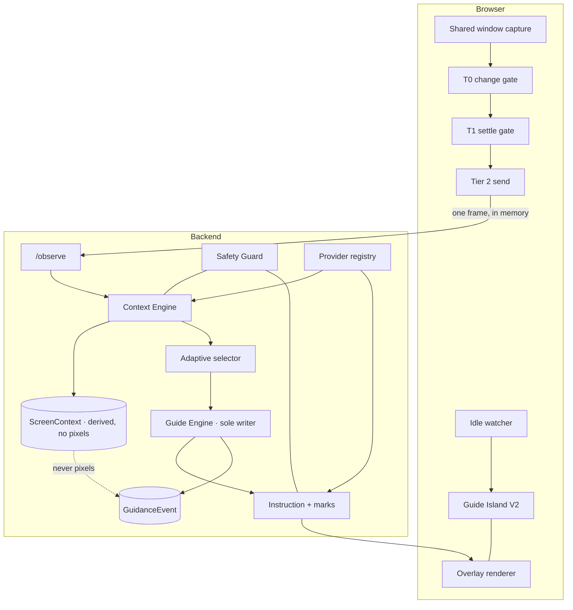

# 22 · Guider V2 · live visual instruction

Status: **proposed, awaiting approval**. No code change is authorized by this document. It records
how the implemented system in [19](19-implementation-status.md) becomes a live visual instructor:
one that reads the screen the user shared, works out where they actually are, and adapts the next
instruction to that, instead of reading a fixed list aloud.

Authority is unchanged. States stay with [05](05-session-state-machine.md), routes with
[07](07-api-contracts.md), entities with [08](08-data-model.md), safety with
[09](09-security-and-privacy.md). This plan adds to them and overrides none. Where V2 needs a
decision those documents do not contain, it is written as an ADR ([019](adr/019-context-engine.md),
[020](adr/020-overlay-surfaces.md), [021](adr/021-managed-provider-mode.md)) rather than settled
here.

## The product sentence

> Guider watches only the window the user shared, understands what is on it, and guides the person
> through the task with light visual marks — never touching their computer.

Everything below serves that sentence. Where a request in the V2 brief cannot serve it inside a
browser, [§4](#4-what-a-browser-cannot-do) says so rather than planning around the problem.

---

## 1 · Invariants

The seven invariants of [20](20-guide-engine-migration-plan.md) carry over unchanged and are not
restated. V2 adds five.

| # | Invariant | Why it is stated |
|---|---|---|
| 8 | **No new capability may reduce test coverage or remove a route.** Every V2 change is additive: new tables, new columns, new routes, new events. No column is dropped, renamed or retyped; no route changes shape incompatibly | The brief's primary rule, made checkable. Contract freshness is already enforced in CI |
| 9 | **The confirmed plan remains the only source of steps.** Context may reorder, skip or revisit steps *within the version the user confirmed*. A step that is not in it requires a new plan version and a new confirmation | [ADR-010](adr/010-one-step-guidance.md). Adaptive guidance must not become an unreviewed plan that grows while the user works |
| 10 | **Context is inference, evidence is evidence.** Anything the Context Engine concludes is a *belief about the screen*, is never persisted as a verification, and can never mark a step verified on its own | The distinction the whole record is built on. A confident guess is still a guess |
| 11 | **A frame is never stored.** Context is derived in memory and discarded with the request; only the derived, content-free context record survives | [ADR-004](adr/004-no-raw-video-storage.md), strengthened rather than relaxed by a system that looks more often |
| 12 | **Every observation the user did not initiate must be stoppable in one action, and must stop itself.** Continuous watching acquires an idle deadline as well as a budget | Continuous observation is the change [21](21-observation-consent-notice.md) exists for |

---

## 2 · What V2 adds

| Capability | Where it lives | Gate before production |
|---|---|---|
| Screen context: application, screen, controls, dialogs, errors, stage | `app/guide/context.py`, new `observe_context` provider role | D01 per provider |
| Adaptive instruction selection: skip what is done, redirect after a mistake, revisit | `app/guide/adapt.py` inside the engine | None new; inside the confirmed plan (invariant 9) |
| Wrong-window detection and recovery | Context Engine + island | None |
| Idle detection with staged prompts and an automatic safe stop | `web/src/guide/idle.ts` + session columns | None |
| Visual overlay marks on the shared window | `web/src/overlay/renderer.ts`, `ProposedInstruction.marks` | Marks over the *user's own desktop* require the native client ([§4](#4-what-a-browser-cannot-do)) |
| Guide Island V2: drag, resize, collapse, fade, dark mode | `web/src/overlay/` | None |
| Provider roster: Gemini, OpenRouter, Groq, DeepSeek, Ollama, LM Studio | `app/providers/` | D01 per provider, per mode |
| Per-role provider configuration with health and usage | `provider_bindings`, `provider_usage` | — |
| Encrypted credential storage | `app/crypto.py` envelope encryption | D02 (key management) |
| Managed (premium) provider mode | Same registry, different credential source | D01 **and** D02 |
| Session resume from home, with a history browser | Existing session rows + list routes | — |
| Voice delivery of the current instruction | `web/src/guide/speech.ts` | D01 speech review |

---

## 3 · Architecture delta

New backend modules, all inside the existing package:

| Module | Responsibility | Must not |
|---|---|---|
| `app/guide/context.py` | Turn one frame into a `ScreenContext`; compare it with the previous one; decide whether anything changed that the guide should act on | Write session state, produce instructions, persist a frame |
| `app/guide/adapt.py` | Given a `ScreenContext` and the confirmed plan, choose which step is current: the same one, a later one already satisfied, or an earlier one to revisit | Invent a step, reorder outside the confirmed version, mark anything verified |
| `app/guide/marks.py` | Validate and normalise the visual marks an instruction carries; clamp them to the frame; drop malformed ones | Trust provider-supplied geometry unchecked |
| `app/crypto.py` | Envelope encryption for provider credentials and provider configuration | Hold a key in process memory longer than a request |
| `app/providers/{gemini,openrouter,groq,deepseek,ollama,lmstudio}.py` | One adapter each, behind the existing protocols | Be named anywhere outside `app/providers/` — the phase-4 gate test still runs |

New web modules:

| Module | Responsibility |
|---|---|
| `web/src/overlay/renderer.ts` | Draw marks over the shared-window preview, in frame coordinates mapped to the element |
| `web/src/overlay/marks.ts` | The mark vocabulary and its geometry model |
| `web/src/guide/idle.ts` | Staged inactivity detection over frame difference and in-app interaction |
| `web/src/guide/speech.ts` | Speak the current instruction, cancel on step change |
| `web/src/settings/providers.tsx` | Per-role provider configuration, connection test, usage |

---

## 4 · What a browser cannot do

This section exists so the roadmap does not promise it.

**A web page cannot draw on another application's window.** The V2 brief asks for an arrow over the
real Download button in the user's real browser, or a spotlight on a menu in VS Code. No web API
allows it, and no permission unlocks it. Document Picture-in-Picture provides a floating *Guider*
window, not a transparent layer over the desktop. Therefore V2 defines two overlay surfaces
([ADR-020](adr/020-overlay-surfaces.md)):

| Surface | Where marks appear | Available |
|---|---|---|
| **Preview overlay** | On the shared window as mirrored inside Guider, in the island or the page | Now, in the browser |
| **Desktop overlay** | On the user's actual screen, over their real application | Only with the signed native client of [ADR-006](adr/006-floating-windows-overlay.md), which [ADR-016](adr/016-web-first-tiered-observation.md) deferred |

Both consume the same `marks` payload, so the instruction contract does not change when the native
client arrives. The preview overlay is a real product, not a placeholder: the user watches Guider's
copy of their window with the mark on it, then acts on their own.

**A web page cannot observe desktop input.** Mouse movement and keystrokes in other applications
are invisible. V2's idle detection therefore measures what it can actually see — absence of visual
change in the shared window, plus absence of interaction with Guider — and says so in the copy. It
never claims to know the user walked away.

**A browser cannot attest which executable it is looking at.** [ADR-011](adr/011-application-allowlisting.md)
is unchanged and still open. Continuous observation stays unavailable in production until native
gates exist, however good the context engine becomes. V2 raises the value of shipping that client;
it does not remove the requirement.

**Window titles are not identity.** `getDisplayMedia` reports a display-surface type and size, not
a process. Wrong-window detection is therefore a *visual* judgement by the observer role, reported
with a confidence, and it advances nothing by itself.

---

## 5 · Vision pipeline

Tiers 0 and 1 are unchanged: a 64×64 greyscale compare every ~500 ms, a 700 ms settle, a 4 s floor,
12 frames per minute, all in the browser, no network. V2 splits what happens after that.

| Tier | Runs | Question | Cost model |
|---|---|---|---|
| T0 | Browser | Did anything change? | Free |
| T1 | Browser | Has it settled? | Free |
| **T2a** | Backend, `observe_context` role | **What is on screen now?** | One cheap call. Target: a small model |
| T2b | Backend, `observe` role | Is the current step's success criterion satisfied? | One call, unchanged from V1 |
| T3 | Backend, `instruct` role | What should the user do next, and where is it? | One call, **only when context materially changed** |

The rule that keeps this affordable: **T3 is not run per frame.** `context.py` produces a
`context_digest` — a stable hash of the fields that matter (application, screen, stage, the control
set, dialog presence, error presence). An unchanged digest means the current instruction still
stands and no reasoning call is made. A changed digest is what buys an instruction.

Per-frame arithmetic at the existing ceiling of 12 admitted frames per minute:

| Path | Calls per minute, worst case | Realistic |
|---|---|---|
| T2a context | 12 | 12 — this is the floor of the design |
| T2b verification | 12 | 2–4; only while a step is waiting on evidence |
| T3 instruction | 12 | 1–3; digest changes are rare inside one step |

The session ceiling of 200 provider calls is now shared across T2a, T2b and T3. Budget accounting
moves from "observation calls" to a per-role tally on the session, so the island can say which part
of the budget was spent. Exhaustion behaves exactly as it does today: watching stops, the guide
keeps working on the user's word, and the island says so once.

### ScreenContext

Derived, content-free, and the only thing that survives the frame:

| Field | Type | Note |
|---|---|---|
| `application` | string ≤80 | What the observer believes it is looking at |
| `application_matches_expected` | bool | Against the step's `application_key` |
| `screen` | string ≤120 | "a download page", "an installer dialog" |
| `stage` | enum | `before_start`, `in_progress`, `step_satisfied`, `later_step_satisfied`, `off_track`, `blocked_dialog`, `unreadable` |
| `controls` | list ≤12 | Label plus normalised box, for marks and for "where" |
| `dialog` / `error_text` | string ≤200 | Present, and what it says, redacted by the guard |
| `confidence` | float | Same bands as verification: 0.85 advance, 0.60 ask |
| `context_digest` | string | Hash of the above, minus confidence and boxes |

`controls[].box` is normalised `0..1` against the frame, never pixels. Every consumer multiplies by
the surface it is drawing into. This is what makes the same payload work in the preview overlay
today and on the native desktop overlay later, across DPI, zoom and monitor changes.

---

## 6 · Adaptive guidance

Today `next_open_step` returns the lowest-ordinal open step. V2 keeps that as the fallback and puts
`adapt.py` in front of it.

| Context stage | What the selector does | What it may never do |
|---|---|---|
| `in_progress` | Nothing. The current step stands | — |
| `step_satisfied` | Hands the step to the existing verification path, which decides whether the confidence earns `verified` | Mark it verified itself |
| `later_step_satisfied` | Proposes marking the intervening steps `skipped` **with the user's confirmation in the island** — one tap, named steps, not silent | Skip a required step silently |
| `off_track` | Keeps the step, changes the instruction to a redirect ("go back to the download page"), and counts an attempt | Restart the task, or replan on its own |
| `blocked_dialog` | Raises the dialog as the immediate obstacle, ahead of the plan's next action | Instruct a click on a dialog the guard restricts |
| `unreadable` | Says so once, and falls back to the user's word | Guess |

Wrong application is a first-class case of `off_track`: the instruction becomes "switch back to VS
Code", no further step guidance is issued, and nothing advances. Three consecutive `off_track`
contexts on one step is a stuck signal, feeding the replanner that already exists.

Skipping forward is the one place where adaptive guidance changes the user's record, so it is the
one place that asks. Everything else is a change of wording, not of history.

---

## 7 · Overlay pipeline

An instruction gains an optional `marks` array. The guard validates it exactly as it validates the
words: malformed, out-of-range or restricted marks are dropped, and a dropped mark never becomes a
silent mis-point.

| Mark | Payload | Use |
|---|---|---|
| `pointer`, `arrow` | anchor + direction | Point at one control |
| `circle`, `rect`, `underline` | box | Enclose a control or a field |
| `spotlight` | box + falloff | Dim everything else |
| `label`, `bubble`, `tooltip` | box + text ≤120 | Name what is being pointed at |
| `pulse`, `glow` | box | Draw the eye, suppressed under reduced motion |
| `progress`, `countdown` | value 0..1 | Installer bars, timed waits |
| `step_badge` | ordinal | Which step this is |
| `confidence` | value 0..1 | How sure Guider is, shown rather than hidden |

Rules the renderer enforces, not the provider:

1. **Normalised geometry only.** Marks arrive in `0..1` frame space; the renderer multiplies by the
   rendered element's box. Scaling, DPI, zoom and a moved window change the multiplier, not the mark.
2. **At most one primary mark.** One pointer or one enclosure per instruction. A screen covered in
   arrows is not guidance.
3. **Never obscure what it points at.** Labels place themselves on the side with room; a mark that
   cannot be placed without covering its own target is degraded to a label in the island.
4. **Reduced motion removes animation, not information.** Pulse and glow become a static ring.
5. **Marks expire with their instruction.** A superseded or invalidated instruction clears its marks
   in the same commit that retires it — the epoch rule already in the engine.
6. **Marks are advisory.** Losing them must never block the guide; a mark that fails to place is a
   logged event, not an error state.

---

## 8 · Guide Island V2

The island keeps its six presentation states and gains a window model. Drag, resize, collapse and
fade become real state, persisted per user — the one exception to the "no browser storage" rule
today, and it stores a geometry preference, never task content.

| Property | Behaviour |
|---|---|
| Placement | Draggable, clamped to the viewport, remembers its corner |
| Size | Three sizes: dot, compact, expanded. Resizable in expanded |
| Fade | Dims after 6 s of no interaction while a step is simply in progress; never fades while a decision is pending, an error is showing, or the observer asked a question |
| Theme | Follows the system, with an explicit override. Dark mode is a V2 requirement, not an option |
| Keyboard | Every control reachable; a documented shortcut opens and collapses it |
| Screen reader | Unchanged: state announced in words and a glyph, one live region, politeness matching urgency |
| Occlusion | Never covers its own overlay marks; moves rather than overlapping |

---

## 9 · Idle and window validation

Staged, and stated in the copy as what it actually measures — no visual change in the shared window
and no interaction with Guider.

| Elapsed | Behaviour |
|---|---|
| 30 s | The island offers help: "Stuck on this? I can explain it differently." |
| 1 min | A quieter reminder, once |
| 3 min | "Watching will pause soon" — with the reason |
| 5 min | Watching stops, `control_epoch` increments, the session is checkpointed and the island shows a resume card |

Nothing is lost at any stage. The 5-minute stop is the existing observation stop, reached by a
timer instead of a tap, recorded as `observation.stopped` with `reason: "idle"`. The session stays
resumable through the route that already exists.

---

## 10 · Provider pipeline V2

The registry, the role protocols and the source gate are unchanged. V2 adds adapters and makes
binding explicit.

**Per-role binding.** A new `provider_bindings` table maps `(owner, role) → (provider, model,
credential)`. `registry.select(role)` consults it, then falls back to the configured default, then
to the fixture. Ollama and LM Studio are marked `local: true`, which the existing `local_only`
selection flag already understands — a user can run observation locally and reasoning in the cloud.

**Credentials.** Envelope encryption in `app/crypto.py`: a per-owner data key wrapped by a KMS key,
ciphertext in the row, plaintext never logged and never returned by any route. The connect route
already returns what the backend connected to rather than what the form said; V2 adds a periodic
health check and a usage tally so the settings page can show truth instead of hope.

**Managed mode.** Premium users bind no credentials; the registry resolves to Guider-managed
adapters whose credentials come from configuration rather than a row. This is one branch in the
credential source, not a second pipeline — [ADR-021](adr/021-managed-provider-mode.md) states why.
It stays behind D01 and D02.

---

## 11 · State machine changes

**No new states.** Every V2 behaviour maps onto rows that already exist in [05](05-session-state-machine.md).

| V2 behaviour | Existing transition | New reason / event |
|---|---|---|
| Context tick with no change | `awaiting_user_action → awaiting_user_action` | `context.unchanged` (event only, no state write) |
| Context changed, new instruction needed | `awaiting_user_action → processing → instruction_ready → awaiting_user_action` | `context_changed` |
| Later step already satisfied, user confirms the skip | existing skip path | `context_skip_confirmed` |
| Wrong application | no transition | `context.off_track` |
| Idle stop | existing observation stop | `observation.stopped` with `reason: idle` |
| Resume from the idle card | existing resume route | unchanged |

New events: `context.observed`, `context.changed`, `context.off_track`, `instruction.marks_dropped`,
`overlay.placement_failed`, `idle.warned`, `idle.stopped`. All content-free; `context.observed`
carries the digest and the stage, never text read off the screen.

---

## 12 · Data model and migrations

Additive only. Five migrations, each independently deployable.

| Migration | Adds | Notes |
|---|---|---|
| `v2_01_context` | `screen_contexts` (session, step, stage, digest, confidence, application, matched, created_at, expires_at) | Retention class **H**, 7 days, same as events. No pixels, no screen text beyond redacted `screen` and `error_text` |
| `v2_02_marks` | `instructions.marks` JSON, nullable | Nullable is the compatibility guarantee: an old client ignores it, a new client renders it |
| `v2_03_bindings` | `provider_bindings`, `provider_usage` | Per-role binding and a per-owner usage tally |
| `v2_04_credentials` | `provider_connections.ciphertext`, `key_id`, `encrypted_at` | Old plaintext column retained and read until a backfill completes, then emptied by a separate migration — never dropped in the same release |
| `v2_05_session_prefs` | `guide_sessions.idle_since`, `idle_warned_at`; `users.island_geometry` | Idle accounting and the island's remembered placement |

Every table carries the composite owner foreign key and joins the deletion cascade, which is the
existing pattern and the reason [§13](#13-security-review) can make a deletion promise at all.

---

## 13 · API changes

Additive. No existing route changes shape; no response field is removed.

| Route | Purpose |
|---|---|
| `POST /sessions/{id}/context` | One frame → `ScreenContext` (+ the instruction, when the digest changed). The `/observe` route is retained unchanged for verification-only clients |
| `GET /sessions/{id}/context` | The last derived context, for a reconnecting client |
| `POST /sessions/{id}/steps/{step}/skip-forward` | Confirm the skip the selector proposed; names every step it would skip |
| `GET/PUT /providers/bindings` | Per-role provider configuration |
| `POST /providers/connections/{id}/health` | Connection test and health |
| `GET /providers/usage` | Usage and remaining budget |
| `GET /sessions?state=&from=&to=&q=` | History filters on the existing list route |
| `GET /sessions/{id}/export` | One session as JSON, for the user's own records |
| `DELETE /tasks/{id}`, `DELETE /sessions/{id}`, `DELETE /account` | **Pre-existing gap, closed as V2.0.** Nothing else ships until they do |

Idempotency, ownership, rate profiles, the error envelope and the audit rules are the existing ones.
`/context` follows `/observe` as the second documented exception to idempotency: a frame is a
sample of the world, not a retryable command.

---

## 14 · Security review

| Area | V2 position |
|---|---|
| Untrusted output | A `ScreenContext` is provider output and is vetted by the guard before it reaches the engine — same posture as an observation, a plan or an import. Text read off a screen is data, never an instruction (SEC-09) |
| Injection via the screen | New surface: a screen can contain text addressed to the model. The guard's existing injection check extends to `screen`, `error_text` and control labels, and a control whose label asks for an action is dropped, not marked |
| Credentials | Envelope-encrypted at rest, never returned, never logged, never in the frontend beyond the POST that sets them. Rotation supported; revocation immediate |
| Marks | Geometry is clamped and validated server-side; a mark pointing outside the frame is dropped. A mark may not carry a link or HTML |
| Local providers | Ollama and LM Studio are loopback-only, and a non-loopback host for a `local` adapter is refused |
| Epoch | Unchanged and load-bearing: stop, pause, idle-stop and revocation all increment it, and in-flight context work bound to an old epoch is discarded |
| Managed mode | A managed credential is never owner-scoped data and never appears in an export |
| Tamper resistance | Events remain append-only and sequenced per session. Signed session records are listed as an open item, not claimed |

---

## 15 · Privacy review

Continuous context is a **greater** privacy commitment than V1's single-frame checks, and
[21](21-observation-consent-notice.md) must be revised and re-approved before it ships:
`observation-draft-1` describes frames checked against a step, not a system that continuously
describes the screen. The notice must say, in the user's words, that Guider forms a running picture
of what is on the shared window; that the picture is kept for seven days as short descriptions with
no image; and how to delete it. `privacy_notice_version` bumps, and existing sessions are asked
again rather than carried forward.

Diagnostic mode — keeping frames — is **opt-in, per session, off by default, and capped at 24
hours**. It is the only path by which a frame is ever written, and it is recorded as a separate
consent with its own version.

---

## 16 · Accessibility

Every V2 surface inherits the existing rules and adds three obligations, because visual marks are by
definition a visual channel:

1. **Every mark has a text equivalent.** The instruction's `where` must locate the control in words
   that work with no overlay at all. An overlay-only instruction is a defect.
2. **Nothing depends on colour.** Marks carry shape and label as well as hue; the confidence
   indicator is a number as well as a ring.
3. **Reduced motion, high contrast and 200 % text are tested as first-class**, not checked at the
   end. Localisation is designed for now — mark labels and instruction text are separate fields — and
   translated later.

---

## 17 · Performance and cost

| Budget | Target | Enforced by |
|---|---|---|
| Browser CPU while watching | < 5 % of one core at 2 fps sampling | T0 downsample is 64×64; no full-frame work in the main thread. Capture and diff move to a worker |
| Frame bytes sent | ≤ 1,280 px longest edge, JPEG | Unchanged from V1 |
| Provider calls per session | 200 total across T2a/T2b/T3 | Shared budget with a per-role tally |
| Instruction latency, context unchanged | 0 ms — no call | `context_digest` comparison |
| Instruction latency, context changed | p95 ≤ 4 s | Small model for T2a, capable model only for T3 |
| Memory | One frame in flight per session | The existing per-session semaphore |

Reuse is the design, not an optimisation: the digest exists so that a screen nobody touched costs
nothing, and a screen that changed in a way the guide does not care about also costs nothing.

---

## 18 · Testing

New IDs, allocated in [16](16-testing-strategy.md) and mapped in [17](17-traceability-matrix.md) in
the same change, per the existing rule.

| ID | Scope |
|---|---|
| T51 | Context derivation: stage classification on fixture frames; digest stability across noise; unreadable and wrong-application cases |
| T52 | Adaptive selection: every stage's selector outcome; a skip forward names its steps and requires confirmation; no step invented outside the confirmed version |
| T53 | Marks: normalised geometry survives DPI, zoom, resize and monitor change; malformed and out-of-range marks dropped; reduced motion removes animation only |
| T54 | Idle: each stage fires once; the 5-minute stop checkpoints, increments the epoch and is resumable; interaction resets |
| T55 | Provider bindings: per-role resolution, local-only routing, health, usage tally, credential encryption round-trip and revocation |
| T56 | Managed mode: no owner credential is required, none is returned, and an export contains none |
| T57 | Screen-sourced injection: instruction-shaped text on a screen never becomes an instruction or a mark |
| T58 | Budget sharing: T2a/T2b/T3 draw one budget; exhaustion stops watching and leaves the guide working |

Cross-browser and cross-platform runs move from aspiration to a named matrix in the same change.
Coverage may not fall: the suite is 348 backend, 120 web unit and 51 browser scenarios at the time
of writing, and each phase below states its own numbers.

---

## 19 · Risks and open decisions

| Item | Why it matters | Needed by |
|---|---|---|
| **Desktop overlay needs the native client** | The most valuable half of V2's visual guidance cannot exist in a browser. Preview overlay ships first and is honest about what it is | V2.3 |
| **Continuous context raises the consent bar** | [21](21-observation-consent-notice.md) must be rewritten and re-approved; the current draft does not describe this system | V2.2, blocks production |
| **False-positive advancement, again** | Adaptive selection can now skip *forward*, which is a new way to be wrong. Skipping asks; the calibration report from PR-20 is the instrument | V2.2 |
| **Cost per session** | T2a runs on every admitted frame. A capable model there would make the product uneconomic; the design depends on a cheap one being good enough, which is unproven | V2.1 |
| **Six new adapters, six new failure modes** | Each needs the matrix test and the guard; a provider that returns plausible nonsense is the worst case | V2.4 |
| **Credential encryption needs real key management** | Envelope encryption without a managed KMS is theatre | D02, V2.4 |
| **Deletion is still missing** | An unclosed privacy gap that V2 must not build on top of | V2.0 |

---

## 20 · Roadmap

Each phase is one or more pull requests. Each compiles, passes the full suite, and ships nothing
that regresses. No phase begins before its predecessor's gate passes.

### V2.0 · Close what is open — *no new capability*
| PR | Work | Exit gate |
|---|---|---|
| 26 | Task, session and account deletion with the erasure cascade and receipts | Deletion removes rows and bytes; a deleted session is gone from history and export; T16/T34/T35 arms pass |
| 27 | Evidence arm of verification: a screenshot checked against a step's criterion | A step reaches `verified` from user-supplied evidence; the self-report arm is unchanged |

### V2.1 · Context Engine — *understanding, no new guidance*
| PR | Work | Exit gate |
|---|---|---|
| 28 | `ScreenContext`, the `observe_context` role, `screen_contexts`, the digest | A fixture screen yields a stable digest across noise; no frame is written; the guard vets context |
| 29 | `POST /sessions/{id}/context`, budget sharing, the island showing what Guider believes it sees | A 10-minute session stays inside 200 calls; an unchanged screen costs nothing |

### V2.2 · Adaptive guidance — *requires the revised consent notice*
| PR | Work | Exit gate |
|---|---|---|
| 30 | `adapt.py`: redirect, revisit, wrong-window | Every stage covered; nothing advances without evidence or the user's word |
| 31 | Skip-forward with confirmation | A forward skip names its steps and cannot happen silently |
| 32 | Revised notice, `privacy_notice_version` bump, existing sessions re-asked | D06 approval recorded |

### V2.3 · Visual guidance
| PR | Work | Exit gate |
|---|---|---|
| 33 | `marks` on instructions, guard validation, `marks.py` | Malformed geometry dropped; text equivalent always present |
| 34 | Preview overlay renderer | Marks survive resize, zoom and DPI change; reduced motion keeps the information |
| 35 | Guide Island V2: drag, resize, fade, dark mode | Keyboard-only and screen-reader runs pass; geometry persists, task content does not |
| 36 | Idle staging and the safe stop | Each stage fires once; the stop is resumable |

### V2.4 · Provider breadth
| PR | Work | Exit gate |
|---|---|---|
| 37 | Gemini, OpenRouter, Groq adapters | The provider matrix test passes for every new adapter; the source gate still holds |
| 38 | Ollama and LM Studio, loopback-enforced | A local binding reaches no non-loopback host |
| 39 | Per-role bindings, health, usage, the settings page | A user runs observation locally and reasoning in the cloud |
| 40 | Credential envelope encryption and rotation | No plaintext at rest; revocation is immediate |

### V2.5 · Continuity
| PR | Work | Exit gate |
|---|---|---|
| 41 | Resume cards on the home screen; history filters, search and export | A session resumes without regenerating a plan |
| 42 | Voice delivery, synchronised with marks | Voice never authorises an action; it can be switched off mid-step |

### V2.6 · Managed mode — *blocked on D01 and D02*
| PR | Work | Exit gate |
|---|---|---|
| 43 | Managed credential source, entitlement, limits | No owner credential required; none returned; none exported |

The native desktop overlay is deliberately **not** in this roadmap. It belongs to the native client
and its own certification, and [ADR-020](adr/020-overlay-surfaces.md) records the boundary so that
V2 does not quietly promise it.

---

## 21 · Traceability

R01–R30 are unchanged. V2 adds no requirement; it deepens R06 (screen access), R07 (pointing), R08
(one instruction), R09 (verification), R10 (adaptation), R17 (scope and risk), R21 (accessibility)
and R23 (cost). New test IDs T51–T58 map to those rows in [17](17-traceability-matrix.md). Every
phase gate above is an addition to [16](16-testing-strategy.md); implemented evidence continues to
be recorded in [19](19-implementation-status.md).
